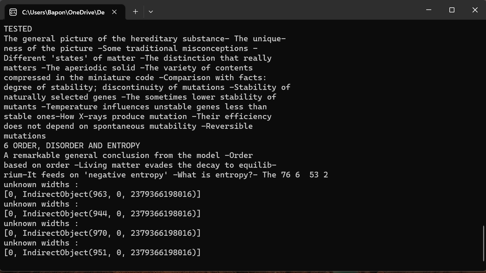

# PDF BOOK READER

This CMD based project convert any pdf document into speech.

<<<<<<< HEAD
Screenshot

=======
It is also included a [Windows .exe file](https://github.com/baponkar/pdf-reader/blob/main/main.exe)
>>>>>>> 2de2751f1404911b12af6398a32e9c993607f3cf

## Used Packages :

[1] [PyPDF2](https://pypi.org/project/PyPDF2/)

[2] [pyttsx3](https://pypi.org/project/pyttsx3/)

